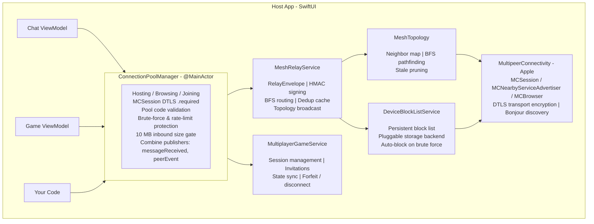
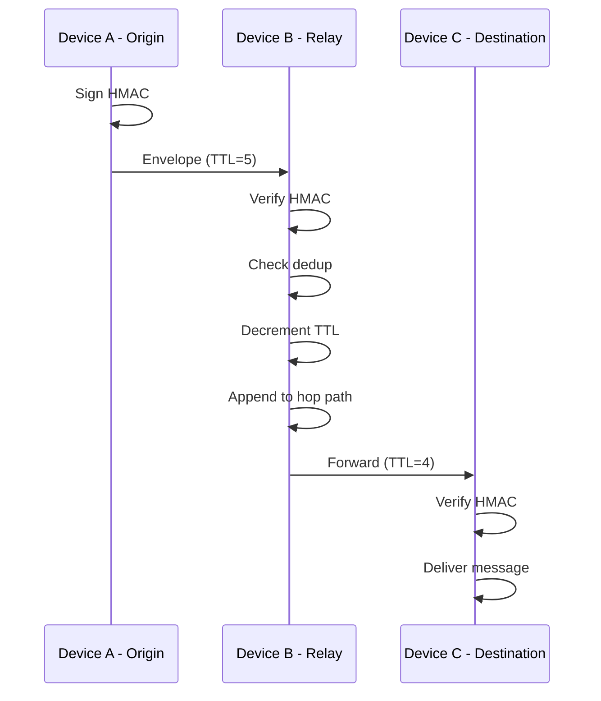
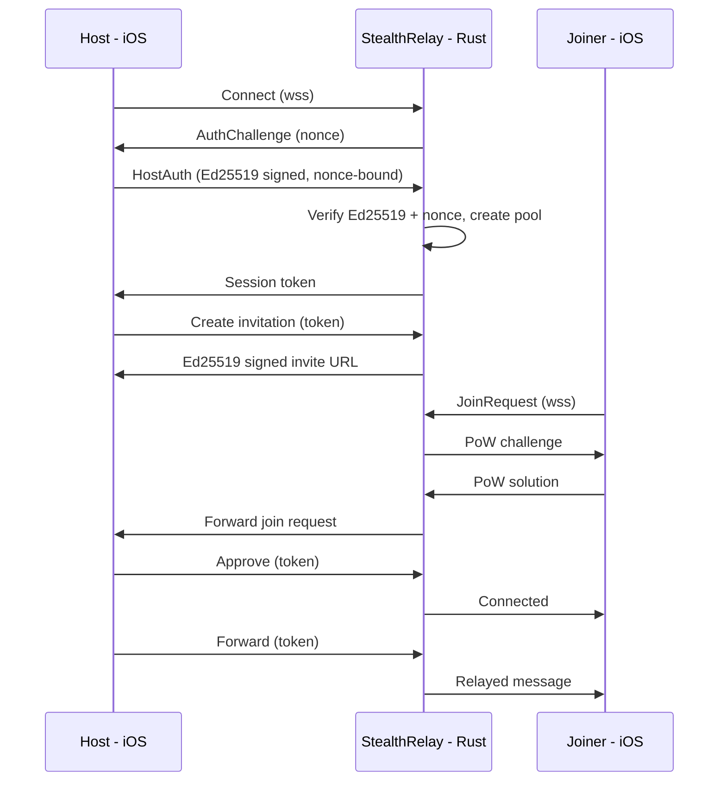

# ConnectionPool

**A zero-dependency P2P mesh networking library for iOS and macOS with local and remote relay support by [Olib AI](https://www.olib.ai)**

Used in [StealthOS](https://www.stealthos.app) — The privacy-focused operating environment.

---

[](https://swift.org)
[](https://developer.apple.com/ios/)
[](https://developer.apple.com/macos/)
[](LICENSE)

## Overview

ConnectionPool is a Swift package that builds a secure mesh network with two transport modes:

1. **Local mode** — MultipeerConnectivity over Wi-Fi and Bluetooth. No internet required.
2. **Remote mode** — WebSocket transport via [StealthRelay](https://github.com/Olib-AI/StealthRelay), a self-hosted Rust relay server. Connect from anywhere.

Both modes enforce end-to-end encryption, authenticate joiners with pool codes or invitation tokens, and protect relay envelopes with HMAC-SHA256. The library was built for StealthOS, where "privacy by default" is not a feature — it is the architecture.

Zero external dependencies. Everything ships in one Swift package.

## Features

- **MultipeerConnectivity-based local P2P** — Discover and connect to nearby devices over Wi-Fi and Bluetooth with Bonjour service advertising
- **Mesh networking with multi-hop relay** — Messages reach peers beyond direct radio range by hopping through intermediate nodes
- **BFS-based topology routing** — Shortest-path routing computed from a distributed neighbor map that each node broadcasts periodically
- **Relay envelope with TTL, loop prevention, and dedup** — Every relayed message carries a TTL counter, an ordered hop path for cycle detection, and a UUID checked against a bounded deduplication cache (10,000 entries, 5-minute expiry)
- **HMAC-SHA256 envelope integrity** — Routing metadata (origin, destination, pool ID, message ID, timestamp) is signed with a key derived via HKDF from the pool ID; tampered envelopes are dropped
- **DTLS encryption enforced on all sessions** — `MCEncryptionPreference.required` on every `MCSession` — primary and relay — so all data in transit is encrypted at the transport layer
- **Pool code authentication** — Hosts generate a join code that is never included in Bonjour discovery info; joiners send it as invitation context and the host validates it server-side before accepting
- **Brute-force protection with auto-blocking** — After 5 failed join attempts from the same device (within a 1-hour window), the device is permanently added to the block list
- **Per-peer rate limiting** — A 5-second cooldown between connection attempts from the same peer prevents invitation flooding
- **10 MB inbound message size limit** — Oversized payloads are dropped before decoding on both the primary and relay sessions
- **Separate relay service type** — Relay discovery uses a distinct Bonjour service type (`stealthos-rly`) to avoid DTLS handshake conflicts with the primary session
- **Persistent device block list** — Blocked devices survive app restarts; storage is pluggable via `BlockListStorageProvider` (defaults to `UserDefaults`, can be wired to encrypted storage)
- **Multiplayer game service** — Built-in session management for turn-based and real-time games: invitations, ready checks, state sync, forfeit handling, and disconnect recovery
- **Configurable logging via protocol injection** — Inject your own `ConnectionPoolLogger` at startup; falls back to Apple's `os.Logger` with per-category subsystems
- **App lifecycle protocol** — `PoolAppLifecycle` lets the host app suspend, resume, and terminate pool operations cleanly
- **Zero external dependencies** — Only Apple frameworks: `MultipeerConnectivity`, `CryptoKit`, `Combine`, `Foundation`, `os`

### Remote Relay Transport ([StealthRelay](https://github.com/Olib-AI/StealthRelay))

- **WebSocket transport** — Connect to a self-hosted relay server from anywhere via `wss://` (default) or `ws://` if explicitly specified
- **Ed25519 host authentication** — The host signs pool creation with a Keychain-stored Ed25519 identity
- **Invitation-based joining** — Shareable `stealth://invite/...` URLs with Ed25519 signatures, HMAC proofs, and configurable expiry
- **Proof-of-Work anti-DoS** — Joining peers solve a SHA-256 PoW challenge (18-bit difficulty, ~50ms) before the server forwards the request to the host
- **End-to-end encrypted relay messages** — Messages relayed via WebSocket are AES-GCM encrypted with a key derived from the pool shared secret via HKDF-SHA256; the relay server sees only opaque ciphertext
- **Session tokens** — All privileged operations (create invitation, kick peer, close pool) require a server-issued session token
- **TLS certificate pinning** — SPKI SHA-256 pin verification via custom `URLSessionDelegate`
- **Server claiming** — First-use server binding via QR code or manual claim code from Docker logs
- **Recovery key after claim** — After claiming a server, the recovery key is displayed in a dedicated sheet with options to save to the password manager or copy to clipboard; the user must acknowledge before proceeding
- **Automatic reconnection** — Exponential backoff with invitation expiry checks; previously-approved peers are auto-accepted on reconnect
- **Relay bridge deduplication** — Messages bridged between relay and primary sessions are deduplicated by `PoolMessage.id` to prevent double processing
- **1 MB WebSocket frame limit** — Incoming WebSocket frames exceeding 1 MB are dropped before processing to prevent memory exhaustion from malicious servers
- **Cloudflare Tunnel support** — Production deployment via `cloudflared` for TLS termination without managing certificates

## Architecture



### Mesh Message Flow



### Remote Relay Flow



## Security

Security is not bolted on — it is structural. Every layer enforces its own guarantees.

### Transport Encryption (DTLS)

All `MCSession` instances — both the primary session and the dedicated relay session — are created with `MCEncryptionPreference.required`. Apple's MultipeerConnectivity framework performs a DTLS handshake before any application data is exchanged.

### Pool Code Authentication

Pool codes are **never** included in Bonjour discovery metadata. A joiner sends the code as part of the invitation context. The host validates it before calling the invitation handler. This prevents passive eavesdroppers from learning the code by observing Bonjour traffic.

### Brute-Force Protection

A global rate limiter tracks total wrong code attempts across all peers — 10 failures in 60 seconds triggers a 30-second cooldown. This cannot be bypassed by rotating peer identities. Per-peer tracking via `DeviceBlockListService` provides supplementary defense.

### Remote Relay Security ([StealthRelay](https://github.com/Olib-AI/StealthRelay))

| Layer | Mechanism |
|-------|-----------|
| **Host Authentication** | Ed25519 signature over `pool_id \|\| timestamp \|\| nonce` where nonce is a server-issued per-connection challenge; timestamp window tightened to 30 seconds |
| **E2E Relay Encryption** | AES-GCM encryption with a key derived from the pool shared secret via HKDF-SHA256 (`stealth-ws-encrypt` info); the relay server sees only opaque ciphertext |
| **Session Tokens** | 32-byte server-issued token required for all privileged operations from both host and guest peers; included in Forward frames for all roles (constant-time comparison) |
| **Invitation Tokens** | Ed25519-signed URLs with HMAC proof-of-possession, configurable expiry and max uses, `server_address` bound in signature |
| **Proof-of-Work** | SHA-256 hashcash (18-bit difficulty) required before join requests are forwarded to the host |
| **TLS Pinning** | SPKI SHA-256 hash pinning via `URLSessionDelegate` (optional, for production deployments) |
| **Server Claiming** | One-time claim code binds a server to a host identity; the code is destroyed after use |
| **Display Name Sanitization** | All display names are stripped of control characters, newlines, and truncated to 64 characters before logging or storage |
| **Per-Pool Isolation** | Pending joins, session tokens, and server URLs are all scoped per-pool — no cross-pool state leakage |

### Relay Envelope Integrity (HMAC-SHA256)

Every outgoing `RelayEnvelope` is signed with an HMAC computed over its immutable routing fields, each length-prefixed to prevent concatenation forgery:

- `originPeerID` (length-prefixed)
- `destinationPeerID` (length-prefixed)
- `poolID`
- `messageID`
- `maxTTL` (constant, not the mutable per-hop TTL)
- `timestamp`

The HMAC key is derived from a pool-level shared secret (not the pool UUID) using HKDF-SHA256. Verification uses CryptoKit's constant-time `isValidAuthenticationCode`. Envelopes without HMAC are rejected — no backwards-compatibility fallback.

### Loop and Amplification Prevention

| Mechanism | What it prevents |
|-----------|-----------------|
| **TTL** (default 5, max 5) | Messages circulating indefinitely |
| **Hop path** | Relaying to a peer already in the path |
| **Deduplication cache** (10,000 entries, 5-min expiry) | Processing the same message twice |
| **Message expiry** (5 minutes) | Replay of old messages |
| **Pool ID validation** | Cross-pool message injection |
| **Topology broadcast freshness** (120s max age) | Replay of stale routing info |
| **Topology broadcast HMAC** (HMAC-SHA256) | Unsigned or tampered topology broadcasts are rejected when a pool shared secret is set |
| **WebSocket frame size limit** (1 MB) | Memory exhaustion from oversized frames sent by malicious servers |

### Inbound Size Limits

All received data — on both the primary `MCSessionDelegate` and the relay session delegate — is checked against a 10 MB hard limit before any decoding is attempted.

### Separate Relay Service Type

Relay discovery operates on a distinct Bonjour service type to prevent DTLS handshake state from colliding with the primary session. The relay session uses its own `MCSession`, `MCPeerID`, and delegate handler, fully isolated from the primary connection.

## Installation

### Swift Package Manager

Add to your `Package.swift`:

```swift
dependencies: [
    .package(url: "https://github.com/Olib-AI/ConnectionPool.git", from: "1.4.0")
]
```

Then add the dependency to your target:

```swift
targets: [
    .target(
        name: "YourApp",
        dependencies: [
            .product(name: "ConnectionPool", package: "ConnectionPool")
        ]
    )
]
```

### Local Package (XcodeGen)

If using XcodeGen, add to your `project.yml`:

```yaml
packages:
  ConnectionPool:
    path: LocalPackages/ConnectionPool

targets:
  YourApp:
    dependencies:
      - package: ConnectionPool
        product: ConnectionPool
```

Then regenerate: `xcodegen generate`

## Quick Start

### Hosting a Pool

```swift
import ConnectionPool

let manager = ConnectionPoolManager.shared

// Configure logging (optional — falls back to os.Logger)
ConnectionPoolConfiguration.logger = MyAppLogger()

// Set user profile
manager.localProfile = PoolUserProfile(
    displayName: "Alice",
    avatarEmoji: "🦊",
    avatarColorIndex: 1
)

// Start hosting with a pool code
let config = PoolConfiguration(
    name: "My Room",
    maxPeers: 8,
    requireEncryption: true,
    generatePoolCode: true
)
manager.startHosting(configuration: config)

// The pool code is available after hosting starts
if let code = manager.currentSession?.poolCode {
    print("Share this code: \(code)")
}
```

### Joining a Pool

```swift
import ConnectionPool
import Combine

let manager = ConnectionPoolManager.shared
var cancellables = Set<AnyCancellable>()

// Start browsing for nearby pools
manager.startBrowsing()

// Observe discovered pools
manager.$discoveredPeers
    .sink { peers in
        for peer in peers {
            print("Found: \(peer.effectiveDisplayName)")
        }
    }
    .store(in: &cancellables)

// Join a discovered pool with the code
if let pool = manager.discoveredPeers.first {
    manager.joinPool(pool, poolCode: "ABC123")
}
```

### Sending and Receiving Messages

```swift
// Send a chat message to all peers
manager.sendChat("Hello, pool!")

// Send a typed message to specific peers
let message = PoolMessage.chat(
    from: manager.localPeerID,
    senderName: manager.localPeerName,
    text: "Direct message"
)
manager.sendMessage(message, to: ["peer-id-here"])

// Receive messages
manager.messageReceived
    .sink { message in
        switch message.type {
        case .chat:
            if let payload = message.decodePayload(as: ChatPayload.self) {
                print("\(message.senderName): \(payload.text)")
            }
        default:
            break
        }
    }
    .store(in: &cancellables)

// Observe peer events
manager.peerEvent
    .sink { event in
        switch event {
        case .connected(let peer):
            print("\(peer.displayName) joined")
        case .disconnected(let peer):
            print("\(peer.displayName) left")
        }
    }
    .store(in: &cancellables)
```

### Hosting a Remote Pool

```swift
import ConnectionPool

let viewModel = ConnectionPoolViewModel()

// Set the relay server URL and create the pool
viewModel.createRemotePool(serverURL: "10.0.0.4:9090")

// If the server is unclaimed, provide the claim code from Docker logs
viewModel.claimCode = "abcd-1234-..."
viewModel.submitClaimCode()

// Create an invitation link for others to join
viewModel.createRemoteInvitation(maxUses: 1, expiresInSecs: 300)

// The invitation URL is available via currentRemoteInvitation
if let invitation = viewModel.currentRemoteInvitation {
    print("Share this link: \(invitation.url)")
}
```

### Joining a Remote Pool

```swift
import ConnectionPool

let viewModel = ConnectionPoolViewModel()

// Join using an invitation URL
viewModel.invitationURLInput = "stealth://invite/..."
viewModel.joinViaInvitation()
```

### Disconnecting

```swift
manager.disconnect()
```

## Self-Hosting the Relay Server

The relay server is a standalone Rust project: [StealthRelay](https://github.com/Olib-AI/StealthRelay)

```bash
# Quick start with Docker
docker run -p 9090:9090 -p 127.0.0.1:9091:9091 ghcr.io/olib-ai/stealth-relay:latest

# With Docker Compose (recommended)
docker compose -f docker/docker-compose.yml up -d

# With Cloudflare Tunnel (production)
docker compose -f docker/docker-compose.yml \
               -f docker/docker-compose.cloudflared.yml up -d
```

See the [StealthRelay README](https://github.com/Olib-AI/StealthRelay) for full deployment documentation.

## Configuration

### Injecting a Custom Logger

```swift
struct MyLogger: ConnectionPoolLogger {
    func log(
        _ message: String,
        level: PoolLogLevel,
        category: PoolLogCategory,
        file: String,
        function: String,
        line: Int
    ) {
        print("[\(level.rawValue)] [\(category.rawValue)] \(message)")
    }
}

// Set before using any ConnectionPool APIs
ConnectionPoolConfiguration.logger = MyLogger()
```

### Injecting Encrypted Block List Storage

```swift
struct SecureStorage: BlockListStorageProvider {
    func save(_ data: Data, forKey key: String) throws {
        // Write to Keychain or encrypted file
    }
    func load(forKey key: String) throws -> Data? {
        // Read from Keychain or encrypted file
    }
}

// Set at app startup
ConnectionPoolConfiguration.blockListStorageProvider = SecureStorage()
```

### Injecting Encrypted Remote Pool State Storage

```swift
// Same protocol as block list storage — reuse your SecureStorage implementation
ConnectionPoolConfiguration.remotePoolStateStorageProvider = SecureStorage()
```

When set, `RemotePoolState` persists through this provider instead of plain `UserDefaults`, preventing connection history (server URL, pool ID, host status) from being stored unencrypted.

## API Reference

### Core Services

| Type | Description |
|------|-------------|
| `ConnectionPoolManager` | Main entry point. Manages hosting, browsing, joining, sending, and peer lifecycle. `@MainActor`, `ObservableObject`. |
| `MeshRelayService` | Coordinates multi-hop message routing, topology broadcasts, deduplication, and HMAC verification. |
| `MultiplayerGameService` | Session management for multiplayer games: invitations, ready checks, state sync, forfeit, disconnect recovery. |
| `DeviceBlockListService` | Persistent block list with pluggable storage backend. |
| `WebSocketTransport` | WebSocket-based transport for remote relay mode. Handles HostAuth, JoinRequest, PoW solving, heartbeats, and automatic reconnection. |
| `RemotePoolService` | Manages host Ed25519 identity (Keychain-stored), invitation creation/parsing, and QR code generation. |
| `ConnectionPoolViewModel` | SwiftUI-ready view model bridging both local and remote transport modes. |

### Models

| Type | Description |
|------|-------------|
| `Peer` | A connected peer with display name, profile, connection type (direct/relayed), and status. |
| `DiscoveredPeer` | A nearby peer found via Bonjour that has not yet joined. Includes relay metadata. |
| `PoolSession` | An active pool session with host info, peer list, max peers, and encryption flag. |
| `PoolConfiguration` | Settings for creating a new pool: name, max peers, encryption, auto-accept, pool code generation. |
| `PoolMessage` | A typed message (chat, game state, game action, system, relay, key exchange, etc.) with encoded payload. |
| `RelayEnvelope` | Routing wrapper for multi-hop messages: TTL, hop path, pool ID, HMAC, encrypted payload. |
| `MeshTopology` | Thread-safe (NSLock) distributed neighbor map with BFS shortest-path routing. |
| `TopologyBroadcast` | Payload for sharing a peer's direct neighbors with the mesh. |
| `PoolUserProfile` | User-facing profile: display name, avatar emoji, color index. |
| `RemotePoolConfiguration` | Settings for remote relay connections: server URL, pool name, max peers, heartbeat interval, SPKI pin hash. |
| `RemotePoolState` | Persisted state for remote pool connections (server URL, pool ID, claim status). Storage is pluggable via `remotePoolStateStorageProvider` (defaults to `UserDefaults`). |
| `RemoteInvitation` | An active invitation with token ID, shareable URL, expiry, and max uses. |
| `ParsedInvitation` | Decoded invitation URL fields: pool ID, token secret, server address, host fingerprint. |
| `RemoteHostIdentity` | Ed25519 signing identity for the pool host (Keychain-stored private key). |
| `ServerFrame` | All WebSocket frame types for client-server communication (HostAuth, Forward, JoinRequest, etc.). |
| `BlockedDevice` | A blocked device entry with peer ID, display name, reason, and timestamp. |

### Protocols

| Type | Description |
|------|-------------|
| `ConnectionPoolLogger` | Inject custom logging. Receives message, level, category, file, function, line. |
| `BlockListStorageProvider` | Pluggable persistence for the device block list (save/load `Data` by key). |
| `PoolAppLifecycle` | Lifecycle hooks: activate, background, suspend, terminate, memory warning. |

### Enumerations

| Type | Description |
|------|-------------|
| `PoolState` | `.idle`, `.hosting`, `.browsing`, `.connecting`, `.connected`, `.error(String)` |
| `PeerStatus` | `.connecting`, `.connected`, `.disconnected`, `.notConnected` |
| `PeerConnectionType` | `.direct`, `.relayed`, `.unknown` |
| `PoolMessageType` | `.chat`, `.gameState`, `.gameAction`, `.gameControl`, `.system`, `.ping`, `.pong`, `.peerInfo`, `.profileUpdate`, `.keyExchange`, `.relay`, `.custom` |
| `PeerEvent` | `.connected(Peer)`, `.disconnected(Peer)` |
| `PoolLogLevel` | `.debug`, `.info`, `.warning`, `.error`, `.critical` |
| `PoolLogCategory` | `.general`, `.network`, `.runtime`, `.games` |

## Requirements

- iOS 17.0+
- macOS 14.0+
- Swift 6.0+
- Xcode 16+

### Entitlements

MultipeerConnectivity requires the **Multicast Networking** entitlement on iOS 14+ and the **Local Network** usage description in your `Info.plist`:

```xml
<key>NSLocalNetworkUsageDescription</key>
<string>ConnectionPool uses the local network to discover and communicate with nearby devices.</string>
<key>NSBonjourServices</key>
<array>
    <string>_stealthos-pool._tcp</string>
    <string>_stealthos-rly._tcp</string>
</array>
```

## License

MIT License

Copyright (c) 2025 Olib AI

Permission is hereby granted, free of charge, to any person obtaining a copy
of this software and associated documentation files (the "Software"), to deal
in the Software without restriction, including without limitation the rights
to use, copy, modify, merge, publish, distribute, sublicense, and/or sell
copies of the Software, and to permit persons to whom the Software is
furnished to do so, subject to the following conditions:

The above copyright notice and this permission notice shall be included in all
copies or substantial portions of the Software.

THE SOFTWARE IS PROVIDED "AS IS", WITHOUT WARRANTY OF ANY KIND, EXPRESS OR
IMPLIED, INCLUDING BUT NOT LIMITED TO THE WARRANTIES OF MERCHANTABILITY,
FITNESS FOR A PARTICULAR PURPOSE AND NONINFRINGEMENT. IN NO EVENT SHALL THE
AUTHORS OR COPYRIGHT HOLDERS BE LIABLE FOR ANY CLAIM, DAMAGES OR OTHER
LIABILITY, WHETHER IN AN ACTION OF CONTRACT, TORT OR OTHERWISE, ARISING FROM,
OUT OF OR IN CONNECTION WITH THE SOFTWARE OR THE USE OR OTHER DEALINGS IN THE
SOFTWARE.

## Credits

- [Olib AI](https://www.olib.ai) — Package maintainer and [StealthOS](https://www.stealthos.app) developer
- [StealthRelay](https://github.com/Olib-AI/StealthRelay) — Self-hosted Rust relay server for remote pool connections
- [Apple MultipeerConnectivity](https://developer.apple.com/documentation/multipeerconnectivity) — Local transport layer
- [Apple CryptoKit](https://developer.apple.com/documentation/cryptokit) — HMAC-SHA256, HKDF key derivation, Ed25519 signing

## Contributing

Contributions are welcome! Please ensure:

1. Code compiles under Swift 6 strict concurrency
2. All public APIs are documented
3. Actor isolation is maintained for thread safety
4. No use of `@preconcurrency` escape hatches unless unavoidable and documented

## Security

If you discover a security vulnerability, please report it privately to security@olib.ai rather than opening a public issue.
